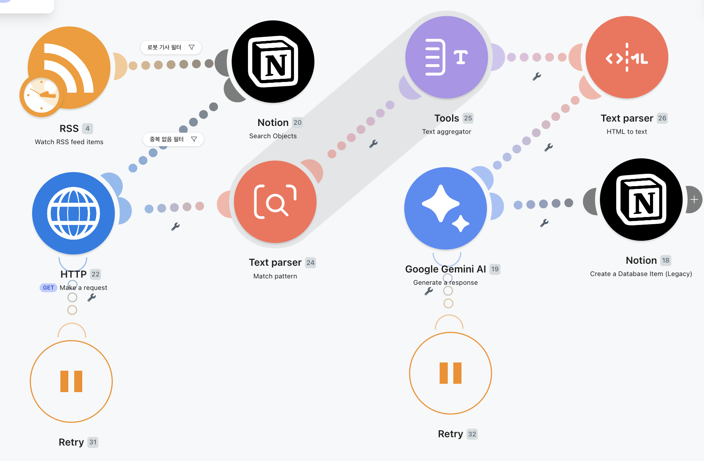

# RSS 기반 로봇 뉴스 자동 수집·요약·저장 시스템



## 1. 프로젝트 개요

본 프로젝트는 Make.com을 기반으로 AI타임스 RSS 피드에서 로봇 관련 기술 뉴스를 자동 수집하고, Gemini로 핵심 내용을 요약한 뒤 Notion 데이터베이스에 저장하는 자동화 시스템이다. 메인 뉴스 요약 시나리오는 매일 09:00에 실행되며, 기사 제목·설명·요약에 `로봇` 키워드가 포함된 항목만 처리한다. 오류 모니터링 시나리오는 매일 09:10에 실행된다. 두 시나리오의 타임존은 `Asia/Seoul`이다.

선별된 기사는 원문 링크를 기준으로 Notion에서 중복 여부를 먼저 확인한다. 신규 기사인 경우에만 HTTP로 원문 HTML을 가져오고, `<p>` 태그 기반으로 본문을 추출·병합·정제한다. 정제된 본문은 Gemini API를 통해 3줄 이내의 한국어 요약문으로 변환되며, 제목·요약문·원문 링크·발행일시와 함께 Notion에 저장된다.

오류 발생 시 Make의 Retry 기능으로 최대 2회 자동 재시도하고, 계속 실패한 실행은 Incomplete executions와 별도 오류 모니터링 시나리오를 통해 추적한다.

## 2. 사용 도구

| 도구 | 용도 |
| --- | --- |
| Make.com | 스케줄 실행과 전체 자동화 흐름 구성 |
| RSS | AI타임스 최신 기사 수집 |
| HTTP | 기사 원문 HTML 요청 |
| Text Parser | `<p>` 태그 기반 본문 문단 추출 |
| Text Aggregator | 추출된 여러 문단을 하나의 본문으로 병합 |
| HTML to text | HTML 태그와 엔티티를 일반 텍스트로 정제 |
| Google Gemini AI | 기사 본문을 3줄 이내의 한국어로 요약 |
| Notion | 정상 처리 결과와 최종 오류 로그 저장 |

- RSS 출처: <https://www.aitimes.com/rss/allArticle.xml>
- 필터 키워드: `로봇`

## 3. 전체 워크플로우

```text
RSS Watch Feed Items
→ 로봇 기사 필터
→ Notion Search Objects
→ 중복 없음 필터
→ HTTP Make a request
→ Text Parser Match Pattern
→ Text Aggregator
→ HTML to text
→ Gemini Generate a response
→ Notion Create Database Item
```

오류 처리 흐름은 메인 시나리오와 분리하여 운영한다.

```text
HTTP/Gemini 오류 발생
→ Retry 최대 2회
→ 계속 실패하면 Make Incomplete executions에 저장
→ 오류 모니터링 시나리오가 실패 실행 조회
→ 오류 ID 기준으로 Notion 중복 확인
→ 중복이 없으면 Notion에 오류 로그 저장
```

전체 시나리오와 모듈별 설정 화면은 `스크린샷/` 하위 폴더에서 확인할 수 있다.

## 4. 주요 기능

- 메인 뉴스 요약 시나리오는 `Asia/Seoul` 기준 매일 09:00에 AI타임스 RSS 피드를 자동 확인한다.
- 오류 모니터링 시나리오는 `Asia/Seoul` 기준 매일 09:10에 실패 실행을 확인한다.
- 제목, 설명 또는 요약에 `로봇`이 포함된 기사만 선별한다.
- 원문 링크를 중복 방지 키로 사용하여 동일 기사 저장과 불필요한 AI 호출을 막는다.
- 원문 HTML에서 `<p>` 문단을 추출한 뒤 하나의 본문으로 병합하고 일반 텍스트로 정제한다.
- 기사 1건당 Gemini 요약을 1회 호출하는 것을 원칙으로 하며, 오류 재시도는 최대 2회로 제한한다.
- Gemini가 생성한 3줄 이내 요약문과 기사 메타데이터를 Notion 속성에 맞게 저장한다.
- Retry, Incomplete executions, 오류 ID를 활용하여 실패 건을 복구·추적하고 오류 로그의 중복 저장을 방지한다.

## 5. 폴더 구조

```text
Term-Project_B_Team_19/
├─ README.md
├─ 문서/
│  ├─ 01_프로젝트_개요.md
│  ├─ 02_워크플로우_구조.md
│  ├─ 03_단계별_역할과_연결_구조.md
│  ├─ 04_노션_데이터베이스_구조.md
│  ├─ 05_주제_필터링_기준.md
│  ├─ 06_에러_처리_정책.md
│  └─ 07_팀_역할_및_개인별_작업_요약/
│     ├─ README.md
│     ├─ 송영준_워크플로우_설명/
│     │  ├─ README.md
│     │  ├─ 송영준_워크플로우.png
│     │  └─ 송영준_노션결과.png
│     ├─ 김연주_워크플로우_설명/
│     │  ├─ README.md
│     │  ├─ 김연주_워크플로우.png
│     │  └─ 김연주_노션결과.png
│     ├─ 이소민_워크플로우_설명/
│     │  ├─ README.md
│     │  ├─ 이소민_워크플로우.png
│     │  └─ 이소민_노션결과.png
│     └─ 박상혁_워크플로우_설명/
│        ├─ README.md
│        ├─ 박상혁_워크플로우.png
│        └─ 박상혁_노션결과.png
├─ 스크린샷/
│  ├─ 01_전체_워크플로우/
│  ├─ 02_RSS_수집_설정/
│  ├─ 03_로봇_기사_필터/
│  ├─ 04_노션_중복_확인/
│  ├─ 05_HTTP_원문_수집/
│  ├─ 06_본문_추출_Text_Parser/
│  ├─ 07_본문_병합_Text_Aggregator/
│  ├─ 08_HTML_to_text_본문_정제/
│  ├─ 09_Gemini_요약_프롬프트/
│  ├─ 10_노션_저장_매핑/
│  ├─ 11_노션_저장_결과/
│  └─ 12_오류_처리_및_모니터링/
├─ Make_시나리오/
│  ├─ 공유_링크.md
│  ├─ 메인_뉴스_요약_시나리오/
│  └─ 오류_모니터링_시나리오/
└─ 결과_예시/
   ├─ 노션_저장_결과/
   └─ Gemini_요약_결과/
```

각 자료는 용도에 맞는 폴더에 배치되어 있으며, Make 시나리오의 Blueprint JSON과 실행 결과 이미지도 포함되어 있다.

스크린샷 폴더에는 다음 자료가 구분되어 있다.

| 폴더 | 포함 자료 |
| --- | --- |
| 01_전체_워크플로우 | Make 전체 시나리오 화면 |
| 02_RSS_수집_설정 | RSS Watch Feed Items 설정 |
| 03_로봇_기사_필터 | 로봇 키워드 필터 조건 |
| 04_노션_중복_확인 | Notion Search Objects 설정 |
| 05_HTTP_원문_수집 | HTTP Make a request 설정 |
| 06_본문_추출_Text_Parser | `<p>` 태그 추출 설정 |
| 07_본문_병합_Text_Aggregator | Text Aggregator 설정 |
| 08_HTML_to_text_본문_정제 | HTML to text 설정 |
| 09_Gemini_요약_프롬프트 | Gemini 프롬프트 |
| 10_노션_저장_매핑 | Notion Create Database Item 매핑 |
| 11_노션_저장_결과 | Notion 데이터베이스 저장 결과 |
| 12_오류_처리_및_모니터링 | Retry, Incomplete executions, 오류 모니터링 시나리오 |

## Make 시나리오 자료

- [Make 시나리오 공유 링크](./Make_시나리오/공유_링크.md)
- 메인 뉴스 요약 및 오류 모니터링 Blueprint JSON 파일은 `Make_시나리오/` 하위 폴더에 포함되어 있습니다.

## 6. 시연 방법

1. Make 시나리오를 `Run once`로 실행한다.
2. 시연 시 RSS 모듈의 `Choose where to start`를 `All RSS feed items`로 설정하면 기존 기사로 테스트할 수 있다.
3. 최종 운영·제출 설정에서는 `From now on`으로 변경하여 새로 올라오는 기사만 처리한다.
4. Notion 데이터베이스에서 신규 기사 저장 결과를 확인한다.
5. Gemini 요약 결과와 원문 링크, 발행일시가 정상 저장되었는지 확인한다.

시연 화면은 `스크린샷/`에서 단계별로 확인할 수 있으며, 최종 저장 및 요약 결과는 `결과_예시/`에 정리되어 있다.

## 7. 오류 처리 방식

HTTP 요청 또는 Gemini 요약 중 오류가 발생하면 Make의 Retry 기능으로 최대 2회 자동 재시도한다. 재시도 후에도 실패한 실행은 Incomplete executions에 보관된다. 별도의 오류 모니터링 시나리오는 실패 실행을 조회하고, 오류 ID가 Notion에 이미 기록되어 있는지 확인한 후 신규 오류만 저장한다.

이 방식은 일시적 네트워크·API 오류의 자동 복구를 시도하면서도, 반복 실패 건을 누락 없이 추적하고 불필요한 Notion API 호출과 중복 오류 로그를 줄인다.

## 8. 팀 역할 요약

모든 팀원은 동일한 주제로 각자 Make 기반 자동화 워크플로우를 설계하고 구현하였다. 이후 구현 결과를 함께 비교하여 구조, 안정성, 구현 난이도, 유지보수성을 검토하고, 필수 요구사항을 안정적으로 충족하는 기능을 중심으로 최종 제출용 워크플로우를 선정하였다. 개인별 작업 내용은 [팀 역할 및 개인별 작업 요약](./문서/07_팀_역할_및_개인별_작업_요약/README.md)에서 확인할 수 있다.

## 9. 상세 문서

1. [프로젝트 개요](문서/01_프로젝트_개요.md)
2. [워크플로우 구조](문서/02_워크플로우_구조.md)
3. [단계별 역할과 연결 구조](문서/03_단계별_역할과_연결_구조.md)
4. [Notion 데이터베이스 구조](문서/04_노션_데이터베이스_구조.md)
5. [주제 필터링 기준](문서/05_주제_필터링_기준.md)
6. [에러 처리 정책](문서/06_에러_처리_정책.md)
7. [팀 역할 및 개인별 작업 요약](./문서/07_팀_역할_및_개인별_작업_요약/README.md)

## 보안 및 제출 주의사항

본 저장소에는 API 키, 인증 토큰, Authorization 헤더 등 민감한 인증 정보는 포함하지 않는다. Make, Notion, Gemini 등의 실제 연결 정보는 제출용 스크린샷에서도 마스킹하여 관리한다. 개인 이메일과 비공개 링크 역시 저장소에 기록하지 않는다.
